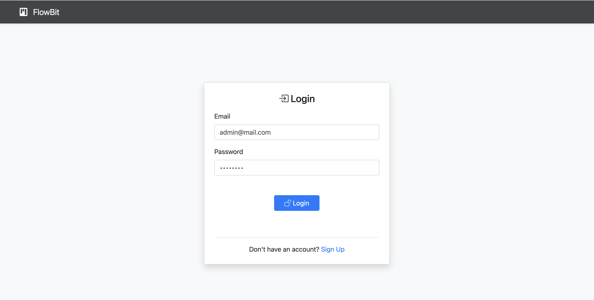
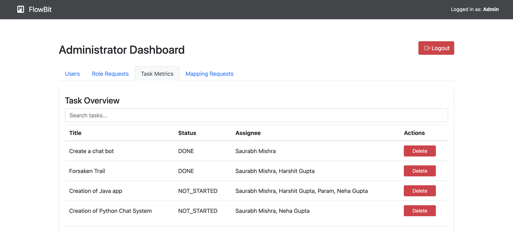
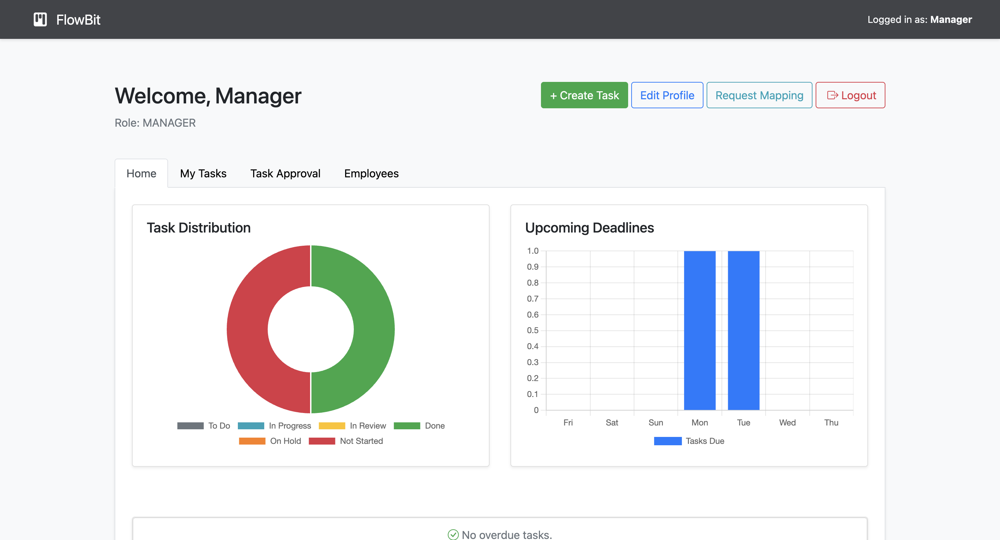
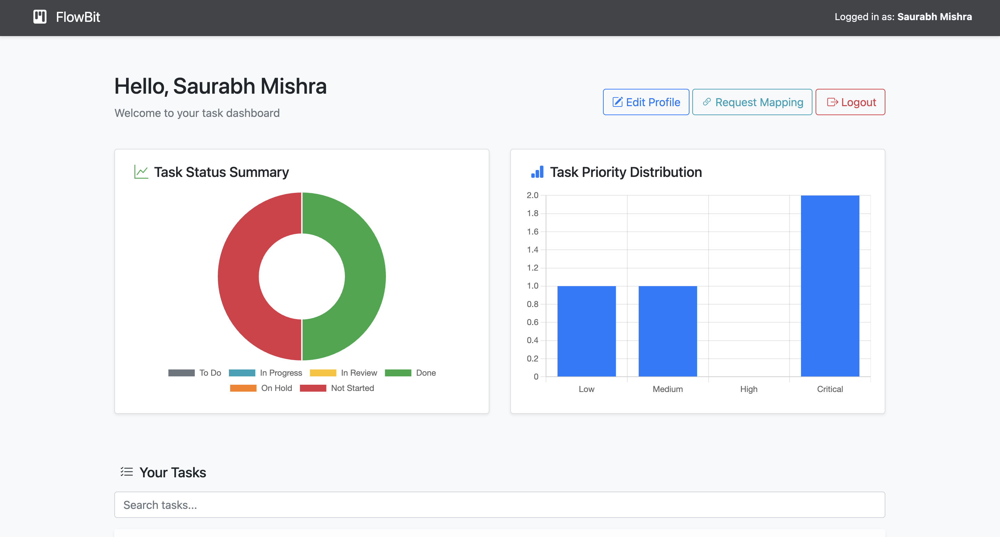

#  FlowBit  Role-Based Task Management System

**FlowBit** is a full-featured, role-based Task Management System built using **Spring Boot**, **JSP**, and **MySQL**, designed for enterprises and teams to streamline task assignment, tracking, and approvals. With real-time dashboards, analytics, file attachments, and employee-manager workflows, FlowBit brings structure and clarity to your project operations.

---

##  Features

###  User & Role Management
- Role-based access: Admin, Manager, Employee
- Role upgrade and mapping requests with approval flow
- Secure authentication with JWT

###  Task Management
- Task creation with priority, tags, estimated/actual hours
- Multi-user assignment & manager-only control
- Status lifecycle: NOT_STARTED  IN_PROGRESS  IN_REVIEW  DONE
- Manager review and approval flow
- Rich-text descriptions, comments, and logs
- File attachments per task

###  Dashboards
- Separate dashboards for Admins, Managers, and Employees
- Status & priority-based charts (Pie/Bar)
- Weekly deadline stats, hours tracking, overdue tasks
- Filterable/searchable tables for tasks, users, and logs

###  Security & Control
- Role-based authorization using Spring Security `@PreAuthorize`
- Secure password change functionality for users and admins
- Validation and sanitization of user inputs

---

##  Tech Stack

| Layer         | Technology                     |
|--------------|---------------------------------|
| Backend       | Spring Boot (Java 8 compatible) |
| Frontend      | JSP, Bootstrap 5, Chart.js      |
| Security      | Spring Security with JWT        |
| Database      | MySQL (with optional H2)        |
| Build Tool    | Maven                          |
| Logging       | SLF4J + Logback                |
| Rich Text     | TinyMCE                        |

---

##  Project Structure

```
src/
 main/
    java/
       com.flowbit/           # All controllers, services, entities, repositories
    resources/
       templates/             # JSP files
       static/                # CSS, JS, images
       application.properties
 test/                          # Unit and integration tests
```

---

##  Getting Started

###  Prerequisites
- Java 8+
- Maven 3.6+
- MySQL 5.7/8.0 (or H2 for local testing)

###  Setup

1. **Clone the repository**

   ```bash
   git clone https://github.com/your-username/flowbit.git
   cd flowbit
   ```

2. **Configure Database**

   Edit `src/main/resources/application.properties`:

   ```properties
   spring.datasource.url=jdbc:mysql://localhost:3306/flowbit
   spring.datasource.username=root
   spring.datasource.password=your_password
   ```

3. **Run the application**

   ```bash
   mvn spring-boot:run
   ```

4. **Access the app**

   Open your browser at: [http://localhost:8080](http://localhost:8080)

---

##  Default Roles & Credentials

| Role   | Email             | Password |
|--------|-------------------|----------|
| Admin  | admin@flowbit.com | admin123 |
| Manager| (sign up + request) | - |
| Employee | (sign up) | - |

---

##  Screenshots

### Login Page


### Admin Dashboard


### Manager Dashboard


### Employee Dashboard



---


##  Contributing

1. Fork the project
2. Create a new branch: `git checkout -b feature/your-feature`
3. Commit changes: `git commit -m "Add your feature"`
4. Push to your fork: `git push origin feature/your-feature`
5. Create a Pull Request

---

##  License

Licensed under the **MIT License**. See [`LICENSE`](LICENSE) for details.

---

##  Acknowledgements

- Spring Boot
- Bootstrap 5
- Chart.js
- TinyMCE
- Jsoup
- MySQL Community

---

> Made with ❤️ by Team FlowBit
